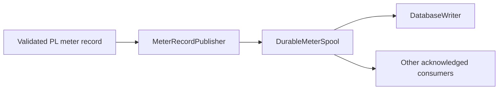

# Future durable meter pipeline

`MeterSnapshotProvider` deliberately provides current-state access only. Its
subscriptions may coalesce updates, and therefore do not guarantee that every
PL record reaches a consumer. This is correct for Web, Modbus, MQTT, and other
latest-value integrations, but it is not a historian interface.

A future lossless implementation should introduce three separate roles:

- `MeterRecordPublisher` publishes every validated record in source order.
- `DurableMeterSpool` persists records and independent consumer cursors before
  acknowledging publication.
- `DatabaseWriter` owns the historian database schema and acknowledges its
  spool cursor only after a successful database transaction.

The spool storage engine and database belong to that future service boundary.
They must not be hidden inside the current snapshot provider or acquisition
ingest path.
