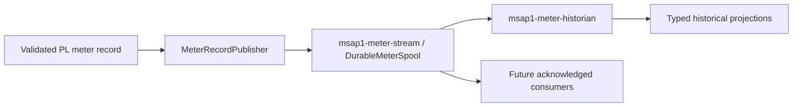

# Durable meter pipeline status

The lossless pipeline proposed by the original version of this document is
now implemented. `MeterSnapshotProvider` remains a current-state interface;
its subscriptions may coalesce updates and are still appropriate for Web,
Modbus, MQTT, and other latest-value consumers.

The separate durable path is:

- Acquisition publishes every accepted record in source order and waits for
  the committed stream cursor before updating the lossy latest snapshot.
- `DurableMeterSpool` persists the exact PL record and an independent ACK
  cursor for each durable consumer.
- The historian decodes records, commits the measurement block and values,
  and acknowledges only after its transaction succeeds.
- Future database writers can register another independent spool consumer;
  they must not read from `MeterSnapshotProvider` when no-loss delivery is
  required.

The complete implementation and extension rules are documented in
[`stream/README.md`](stream/README.md).
