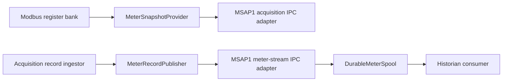

# Future MeterDataProvider layout cleanup

## Status

This is a deferred source-layout cleanup. Do not perform it as part of the
initial Modbus implementation.

The product-neutral meter access APIs should eventually share one library
root:

```text
common/mnc/MeterDataProvider/
├── attributes/
├── snapshot/
└── stream/
```

The existing `attributes/` and `snapshot/` directories remain in place.
Product-neutral files currently under `common/mnc/MeterDataStreamer/` should
move into `MeterDataProvider/stream/` when this cleanup is scheduled.

## Motivation

Snapshot and stream access expose the same meter vocabulary but provide
different delivery guarantees:

- `snapshot/` returns the latest typed state. It is intentionally lossy and
  is appropriate for Modbus, Web, CLI, and telemetry polling.
- `stream/` delivers every accepted record through ordered consumer cursors.
  It is appropriate for historians and database writers.

Keeping both beneath `MeterDataProvider` makes this relationship visible
without combining their semantics or allowing Modbus to depend on the durable
database path.

## Proposed layout

```text
common/mnc/MeterDataProvider/
├── attributes/
│   ├── meter_attribute.hpp
│   ├── meter_attribute_set.hpp
│   └── meter_attribute_catalog.cpp
├── snapshot/
│   ├── meter_snapshot.hpp
│   └── meter_snapshot_provider.hpp
└── stream/
    ├── database_policy.hpp
    ├── meter_record_publisher.hpp
    ├── meter_stream_consumer.hpp
    ├── durable_meter_spool.hpp
    └── durable_meter_spool.cpp
```

MSAP1-specific IPC adapters remain outside the product-neutral library:

```text
common/msap1/meter/MeterDataProvider/
├── snapshot/
│   └── acquisition_meter_data_provider.*
└── stream/
    └── meter_stream_ipc.*
```

The intended dependency boundaries remain:



## Migration steps

1. Split the declarations in `meter_stream.hpp` into focused headers under
   `MeterDataProvider/stream/`.
2. Move the product-neutral stream implementation and database policy without
   changing public class names or behavior.
3. Update include paths and the `mnc::meter-data-streamer` CMake target. Keep a
   temporary forwarding header if downstream repositories require a staged
   migration.
4. Move the MSAP1 stream IPC adapter beneath the corresponding MSAP1 provider
   hierarchy; keep its protocol and socket path unchanged.
5. Update documentation and dependency checks.
6. Remove the old `MeterDataStreamer` directory only after all includes and
   tests use the new paths.

## Compatibility requirements

- Do not change the `MeterSnapshotProvider`, `MeterRecordPublisher`, or
  `MeterStreamConsumer` behavior.
- Do not change meter-stream IPC, cursor acknowledgement, database schema,
  retention policy, or systemd service behavior.
- Modbus must continue to use only `MeterSnapshotProvider`; it must not read
  the durable spool or historian database.
- Acquisition must still durably publish a validated record before updating
  the lossy latest-state view.
- Complete the cleanup as a dedicated refactor with build, unit-test, target,
  and include-dependency verification.

