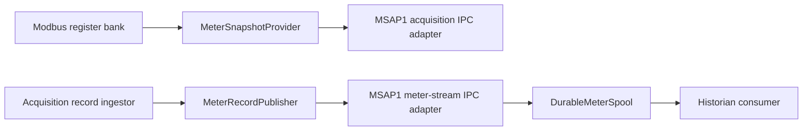

# MeterDataProvider layout

## Status

This document records the implemented meter-data access boundaries.

The product-neutral meter access APIs share one library root:

```text
common/mnc/MeterDataProvider/
├── meter_data_provider.hpp
├── attributes/
├── snapshot/
└── stream/
```

The existing `attributes/` and `snapshot/` directories remain in place.
The durable stream interfaces and implementation live beside the snapshot API
under `MeterDataProvider/stream/`.

## Motivation

Snapshot and stream access expose the same meter vocabulary but provide
different delivery guarantees:

- `snapshot/` returns the latest typed state. It is intentionally lossy and
  is appropriate for Modbus, Web, CLI, and telemetry polling.
- `stream/` delivers every accepted record through ordered consumer cursors.
  It is appropriate for historians and database writers.

Keeping both beneath `MeterDataProvider` makes this relationship visible
without combining their semantics or allowing Modbus to depend on the durable
database path.

## Implemented layout

```text
common/mnc/MeterDataProvider/
├── attributes/
│   ├── meter_attribute.hpp
│   ├── meter_attribute_set.hpp
│   └── meter_attribute_catalog.cpp
├── snapshot/
│   ├── meter_snapshot.hpp
│   └── meter_snapshot_provider.hpp
└── stream/
    ├── database_policy.hpp
    ├── meter_stream_record.hpp
    ├── meter_stream_status.hpp
    ├── meter_record_publisher.hpp
    ├── meter_stream_consumer.hpp
    ├── durable_meter_spool.hpp
    ├── durable_meter_spool.cpp
    └── meter_stream.hpp
```

MSAP1-specific IPC adapters remain outside the product-neutral library:

```text
common/msap1/meter/MeterDataProvider/
├── snapshot/
│   ├── in_process_meter_snapshot_provider.*
│   └── acquisition_meter_snapshot_provider.*
└── stream/
    └── meter_stream_ipc.*
```

The intended dependency boundaries remain:



## Public roles

`MeterDataProvider` is a consumer-facing facade with two explicit accessors:

```cpp
provider.snapshot_provider(); // latest state; intermediate updates may vanish
provider.stream_consumer();   // ordered records with explicit acknowledgement
```

`MeterDataProviderView` combines independently implemented providers by
non-owning reference. The `View` suffix makes that lifetime contract visible.
It is a dependency-injection convenience at composition roots, not a reason
to pass both capabilities to every subsystem.

Record publication is deliberately a third, separate role:

```cpp
class MeterRecordPublisher;
```

Acquisition receives that narrow write-side interface. It is not exposed by
the consumer facade, so a Modbus, Web, CLI, or historian reader cannot inject
records.

## Compatibility requirements

- `MeterSnapshotProvider`, `MeterRecordPublisher`, and `MeterStreamConsumer`
  retain separate behavior and dependencies.
- Do not change meter-stream IPC, cursor acknowledgement, database schema,
  retention policy, or systemd service behavior.
- Modbus must continue to use only `MeterSnapshotProvider`; it must not read
  the durable spool or historian database.
- Acquisition must still durably publish a validated record before updating
  the lossy latest-state view.
- Verify the component with build, unit-test, target, and include-dependency
  checks whenever either delivery path changes.
