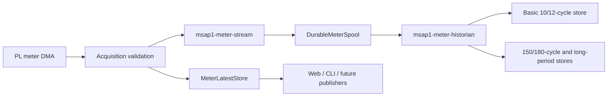

# MeterDataProvider durable-stream architecture

## Purpose

The MeterDataProvider module separates two different delivery guarantees:

- `MeterData` and `MeterSnapshotProvider` expose the newest typed state. These
  paths are intentionally lossy and optimized for Web, CLI, Modbus, and
  publisher polling.
- `MeterRecordPublisher` and `MeterStreamConsumer` expose every validated PL
  record through ordered, independently acknowledged cursors. This path is
  used by historian and future database writers.



Acquisition must publish to the spool first. Only after the stream service
returns the committed cursor may acquisition apply the record to the latest
store. A spool failure therefore stops meter and waveform DMA instead of
silently dropping accepted data.

## Reusable interfaces

Product-neutral code lives under `mnc::meter_stream`:

```cpp
class MeterRecordPublisher {
public:
    virtual std::uint64_t publish(const MeterStreamRecord&) = 0;
};

class MeterStreamConsumer {
public:
    virtual void register_consumer(std::string_view name) = 0;
    virtual std::vector<MeterStreamRecord>
        read_after(std::string_view name, std::size_t limit) = 0;
    virtual void acknowledge(std::string_view name,
                             std::uint64_t cursor) = 0;
};
```

MSAP1 codecs and Boost.Asio IPC adapters live under `common/msap1`. The IPC
preserves the exact PL payload, record kind/period, source sequence,
configuration generation, ingest time, and measurement timing provenance.

## Storage and retention

Persistent databases live below `/data/mnc/database`:

```text
/data/mnc/database/
├── meter-stream/spool.sqlite3
└── meter-historian/historian.sqlite3
```

The small `mnc::storage::sqlite` library is an RAII wrapper over the SQLite C
API. SQLiteCpp is intentionally not used. Volatile datasets use SQLite
`:memory:` so the same schema and queries are exercised for both backends.

Default policies are:

| Dataset | Backend | Retention |
|---|---|---|
| Raw record spool | Persistent | 24 hours after every consumer ACK |
| Basic 10/12-cycle | Memory | 24 hours and 512 MiB |
| 150/180-cycle | Persistent | Forever |
| 10-minute | Persistent | Forever |
| 2-hour | Persistent | Forever |

Unacknowledged spool records are never pruned. Switching a projection backend
replays retained spool records using an independent temporary cursor. Live
historian consumption pauses behind the migration lock, so new records remain
queued in the spool and cannot overtake backfill. If the oldest retained spool
cursor is greater than one, status explicitly reports that older history is
unavailable for reconstruction.

## Historian schema

`measurement_blocks` stores record/period identity, source sequence,
configuration generation, measurement time, source sample window, and quality.
`measurement_values` stores one signed engineering-unit value and quality per
attribute. Attribute units come from the meter attribute catalog; a valid zero
is never represented as unavailable data.

New PL record kinds are added through the typed decoder registry. New meter
attributes extend the catalog and value insertion mapping without changing
the transport or spool schema.

## Runtime configuration

Database policy is part of the typed product settings document. The settings
service hot-applies the spool policy first, then historian policies, and
finally acquisition settings. If a later step fails, the coordinator reapplies
the previous complete snapshot. Selecting an in-memory spool requires an
explicit warning acknowledgement because `durability=false` is intentional.

The administrator-only Developer → Database page reports service health,
cursors, lag, storage use, retained ranges, and migration/backfill state. The
History page queries bounded typed series through the Web backend; browsers
never open SQLite files or daemon sockets directly.
