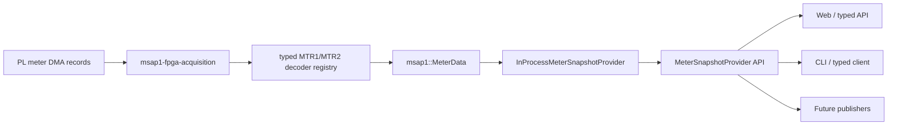

# MSAP1 MeterDataProvider programming guide

This guide explains how an APU application reads typed meter values through
`MeterDataProvider`, `MeterSnapshotProvider`, and
`InProcessMeterSnapshotProvider`. The snapshot examples are intended for Web,
CLI, Modbus, telemetry, and other latest-value consumers. Durable ordered
consumption is documented separately in
[`common/mnc/MeterDataProvider/stream/README.md`](../../common/mnc/MeterDataProvider/stream/README.md).

## 1. Provider boundary

The provider is the single typed access point for current MSAP1 measurements:

`MeterData` owns latest period views. `InProcessMeterSnapshotProvider` projects a typed
MSAP1 view into the product-neutral `mnc::meter::MeterSnapshot` shape. Consumers
do not open `/dev/msap1-meter`, read RPMsg, parse MTR1 records, or know the PL
record layout.

`MeterDataProvider` is the common consumer-facing facade. It exposes two
different guarantees without mixing them:

~~~cpp
auto &latest_values = provider.snapshot_provider();
auto &ordered_records = provider.stream_consumer();
~~~

The first may coalesce intermediate updates; the second uses durable ordered
cursors. Most consumers should receive only the narrower interface they use.
Acquisition receives the separate `MeterRecordPublisher` write-side interface.

The provider currently advertises:

| Period | Meaning | Availability |
| --- | --- | --- |
| `Basic` | 10 complete cycles at 50 Hz or 12 at 60 Hz | Supported |
| `Cycles150_180` | 15 Basic blocks (150/180 cycles) | Supported |
| `Min10` | Clock-aligned ten-minute aggregate | Supported |
| `Hour2` | Clock-aligned two-hour aggregate | Supported |
| `Min10Live` | Current open ten-minute interval | Supported, non-normative |
| `Hour2Live` | Current open two-hour interval | Supported, non-normative |

The finalized long-interval views are independent of the Basic and
150/180-cycle views and retain the R5C1-provided target, actual boundary,
overshoot, contamination, time-quality, and sample-window provenance. Their
live counterparts expose the still-open interval explicitly and must not be
treated as normative finalized results.

## 2. Headers and linking

~~~cpp
#include "mnc/MeterDataProvider/attributes/meter_attribute.hpp"
#include "mnc/MeterDataProvider/attributes/meter_attribute_set.hpp"
#include "mnc/MeterDataProvider/snapshot/meter_snapshot_provider.hpp"
#include "msap1/meter/MeterDataProvider/snapshot/in_process_meter_snapshot_provider.hpp"
#include "msap1/meter/meter_data.hpp"
~~~

An in-process consumer links against the focused meter library:

~~~cmake
target_link_libraries(my_meter_consumer PRIVATE msap1::meter)
~~~

The Web backend and CLI normally use the typed acquisition client instead of
constructing a provider. The same request and response semantics apply over IPC.

## 3. Constructing a provider

The provider references the application's `MeterData`; it does not own the
acquisition thread or copy the whole store:

~~~cpp
msap1::MeterData data;
msap1::meter::InProcessMeterSnapshotProvider provider(data);

for (const auto& capability : provider.capabilities()) {
    std::cout << "period=" << static_cast<int>(capability.period)
              << " attributes=" << capability.attributes.size() << '\n';
}
~~~

In the acquisition service, records are decoded first and then applied:

~~~cpp
const auto update = decoder_registry.decode(record);
if (update) {
    meter_data.apply(*update);
}
~~~

A provider never performs hardware I/O itself.

## 4. Fetching a complete current snapshot

An empty attribute list means the provider's canonical set for that period.
The call returns `std::nullopt` before the first matching record arrives:

~~~cpp
mnc::meter::MeterSnapshotRequest request;
request.period = mnc::meter::MeasurementPeriod::Basic;

const auto snapshot = provider.latest(request);
if (!snapshot) {
    // Acquisition has not produced a Basic record yet.
    return;
}

std::cout << "sequence=" << snapshot->sequence
          << " generation=" << snapshot->configuration_generation
          << " values=" << snapshot->values.size() << '\n';
~~~

The snapshot contains measurement provenance:

~~~cpp
std::cout << "updated ns=" << snapshot->updated_at_nanoseconds << '\n';
if (snapshot->timing) {
    std::cout << "samples=" << snapshot->timing->sample_count
              << " cycles=" << snapshot->timing->cycle_count << '\n';
}
~~~

Do not recompute a timestamp from the time at which a request ran. Sequence,
updated time, and timing fields describe the measurement itself.

## 5. Selecting attributes and groups

An explicit request keeps caller order after duplicate removal:

~~~cpp
using mnc::meter::MeterAttributeId;
using mnc::meter::MeterAttributeKey;

mnc::meter::MeterSnapshotRequest request;
request.period = mnc::meter::MeasurementPeriod::Basic;
request.attributes = {
    MeterAttributeKey{MeterAttributeId::Frequency, std::nullopt},
    MeterAttributeKey{MeterAttributeId::VanRms, std::nullopt},
    MeterAttributeKey{MeterAttributeId::IaRms, std::nullopt},
};
const auto snapshot = provider.latest(request);
~~~

`MeterAttributeKey::index` is reserved for future indexed families. Current
scalar attributes use `std::nullopt`.

Use `MeterAttributeSet` to combine extensible groups:

~~~cpp
mnc::meter::MeterAttributeSet selection;
selection.add(mnc::meter::MeterAttributeGroup::Frequency);
selection.add(mnc::meter::MeterAttributeGroup::VoltageLnRms);
selection.add(mnc::meter::MeterAttributeGroup::CurrentRms);

request.attributes = selection.values();
~~~

Groups are insertion ordered and duplicate-free:

| Group | Members |
| --- | --- |
| `Frequency` | Grid frequency |
| `VoltageLnRms` | VLA, VLB, VLC |
| `VoltageLlRms` | VAB, VBC, VCA |
| `CurrentRms` | ILA, ILB, ILC, ILN |
| `Fundamental` / `AllDefined` | Canonical scalar catalog, including power, phasor, sequence, and unbalance |

## 6. Reading values safely

`MeterSnapshot::values` is a list because requests can select any subset:

~~~cpp
const mnc::meter::MeterAttributeValue* find_value(
    const mnc::meter::MeterSnapshot& snapshot,
    mnc::meter::MeterAttributeId id) {
    for (const auto& value : snapshot.values) {
        if (value.attribute.id == id && !value.attribute.index) {
            return &value;
        }
    }
    return nullptr;
}

if (const auto* value = find_value(*snapshot,
                                   MeterAttributeId::Frequency)) {
    if (value->quality == mnc::meter::ReadingQuality::Valid) {
        // Millihertz: 59998 means 59.998 Hz.
        const double hz = static_cast<double>(value->value) / 1000.0;
        std::cout << hz << " Hz\n";
    }
}
~~~

The integer value and unit are paired:

| Unit | Stored value | Example |
| --- | --- | --- |
| `MilliHertz` | mHz | `59998` = 59.998 Hz |
| `MicroVolts` | µV | `120000000` = 120 V |
| `MicroAmperes` | µA | `5000000` = 5 A |

Inspect `quality` before display. `Valid` zero is a real zero measurement;
`Unavailable` means no value was supplied or the channel is unsupported.
Other qualities distinguish invalid, out-of-range, timeout, and arithmetic
failures. Each value retains source sequence, measured time, sample count, and
calculation window.

## 7. Unsupported and malformed requests

Known attributes not implemented for a period are returned as `Unavailable`.
Frequency, for example, is a standardized Basic-period product; the finalized
aggregate periods expose their line-line voltage, power, phasor, sequence, and
unbalance values without reconstructing them in a consumer.

Malformed IDs or invalid indexed keys are configuration/programming errors and
cause `std::invalid_argument`. Reject user-supplied selectors at the API
boundary rather than silently presenting a plausible zero.

## 8. Latest-value subscriptions

Use a subscription when a consumer wants the newest snapshot without polling:

~~~cpp
mnc::meter::MeterSnapshotRequest request;
request.period = mnc::meter::MeasurementPeriod::Basic;
request.attributes = {
    {mnc::meter::MeterAttributeId::Frequency, std::nullopt},
    {mnc::meter::MeterAttributeId::VanRms, std::nullopt},
};

auto subscription = provider.subscribe_latest(
    request,
     {
        // Keep this callback short and non-blocking.
        std::cout << "new sequence=" << snapshot.sequence << '\n';
    });

// Keep subscription alive; destruction unsubscribes automatically.
~~~

`LatestSubscription` is move-only RAII state. The callback receives a projected
snapshot, not the internal `MeterPeriodView`.

This is a latest-state subscription, not a durable FIFO. If a callback is slow,
intermediate updates may be coalesced. Do not block DMA ingestion, perform long
database writes, or synchronously call back into acquisition. Consumers that
must receive every record belong on the future
`MeterRecordPublisher -> DurableMeterSpool -> DatabaseWriter` pipeline described
in `common/mnc/MeterDataProvider/FUTURE_DURABLE_METER_PIPELINE.md`.

## 9. Web and CLI workflow

~~~mermaid
sequenceDiagram
    participant C as Web or CLI
    participant G as Typed acquisition client
    participant A as Acquisition service
    participant P as InProcessMeterSnapshotProvider
    participant D as MeterData
    C->>G: MeterSnapshotRequest
    G->>A: Current acquisition IPC request
    A->>P: latest(request)
    P->>D: latest(period)
    D-->>P: immutable period view
    P-->>A: MeterSnapshot
    A-->>G: typed response
    G-->>C: human or JSON result
~~~

The Web backend maps the typed result to `MeterSnapshotResponse` and JSON DTOs.
The CLI uses the same request and selects human or machine output. Neither
frontend parses MTR1 or accesses DMA.

## 10. Recommended workflow and tests

1. Build a request with a period and empty, individual, or grouped attributes.
2. Use `capabilities()` to drive user-selectable periods and fields.
3. Call `latest()` for a one-off result or retain `subscribe_latest()` for a
   dashboard.
4. Treat `std::nullopt` as “no record yet.”
5. Check quality and unit before conversion.
6. Preserve sequence and timing metadata downstream.
7. Keep callbacks short and queue expensive work in the consumer.
8. Use the future durable stream for historians.

Test no-first-record for every supported period, empty/grouped selection,
ordering, duplicates, unsupported fields, malformed selectors, timing
provenance, valid zero versus unavailable, subscription lifetime, and callback
coalescing. See
`docs/IPC_SERVICE_ARCHITECTURE.md` for the authoritative transport description.
