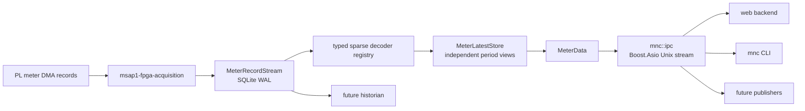
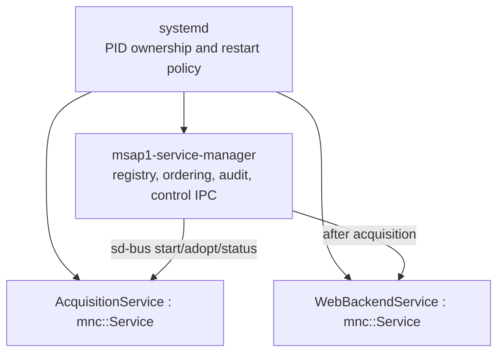

# IPC, meter data, and service architecture

## Data flow and durability boundary



`MeterRecordStream::append()` is the publication boundary. The acquisition
daemon does not expose a record to the decoder, latest store, IPC clients, or
future publishers until SQLite has committed it. The database uses WAL mode
and `synchronous=FULL` at:

```text
/data/mnc/meter/record-stream.sqlite3
```

A database failure is fatal to acquisition because continuing would silently
lose accepted PL data. Durable consumers register a name, read forward from a
cursor, and acknowledge independently. Records can be pruned only after all
registered durable consumers have acknowledged them and the safety window has
expired.

## Typed multi-period meter data

`MeterUpdate` is a sparse decoded PL update. A decoder declares its update
period and supplies only the value groups present in that record. The initial
`MTR1` decoder produces a 200 ms fundamental update; future power, energy,
demand, and power-quality formats register their own decoders without changing
the transport.

Canonical periods are `200 ms`, `1 s`, `3 s`, `10 s`, `10 min`, and `2 h`.
Each `MeterLatestStore` slot is independent. For example, a new 200 ms
frequency never overwrites or supplies a missing 1 s frequency.

```cpp
using namespace std::chrono_literals;

const auto view = meter_data.latest(200ms);
if (view && view->values.fundamental.frequency.valid()) {
    const std::int64_t millihertz =
        view->values.fundamental.frequency.value;
}
```

Every reading carries its exact integer engineering unit, quality, source
sequence, measurement time, and PL calculation window. Unavailable and valid
zero are distinct states. The APU decodes and distributes measurements; it
does not calculate meter values.

Each latest-state subscription owns a small worker with a single pending
view. If its consumer is slow, a newer view replaces the unread one. This is
intentional for Web and publishing services: they cannot block acquisition or
the durable stream. Consumers that must observe every record use
`MeterRecordStream` with their own durable cursor instead.

## `mnc::ipc` transport

`mnc::ipc` is product-neutral. It uses
`boost::asio::local::stream_protocol`, so it explicitly frames the byte stream.
Every frame begins with this 24-byte little-endian envelope:

| Offset | Size | Field |
|---:|---:|---|
| 0 | 4 | `MNCI` magic |
| 4 | 2 | envelope version |
| 6 | 2 | request, response, event, or error kind |
| 8 | 4 | product-defined message type |
| 12 | 4 | payload size |
| 16 | 8 | correlation ID |

The transport always reads the complete header and then the declared payload.
It limits payload size, queued frames, and queued bytes; malformed, truncated,
oversized, or slow-client-overflow connections are closed. A connection has
one reader and one strand-serialized write queue. `RequestClient` matches
responses by correlation ID and dispatches server-pushed events. CLI commands
use `BlockingClient`, which runs the same coroutine transport behind a
synchronous facade.

MSAP1 message definitions remain in `msap1::acquisition::protocol`. Product
payloads use `ByteWriter`/`ByteReader` and explicit little-endian fields; do
not copy native structures, enum storage, padding, or floating-point layouts
onto the wire. Unix peer credentials are read with `SO_PEERCRED` for
authorization.

## Service lifecycle and manager



`mnc::Service::execute()` centralizes signal handling, readiness notification,
watchdog notification, reload dispatch, exception containment, and orderly
shutdown. Derived services implement only `on_start()`, `on_reload()`,
`on_stop()`, and `health()`.

`mnc::ServiceManager` does not replace systemd. It registers the product
services, starts them in dependency order, adopts already-running units after
its own restart, inspects restart counts through sd-bus, and exposes bounded
control through `/run/monutchee/service-manager.sock`. Read-only status is
available to diagnostics; mutating operations require root peer credentials.

```sh
mnc service list
mnc service status fpga-acquisition
mnc service restart web-backend
mnc service reload fpga-acquisition
```

Future publishers should inherit `mnc::Service`, use a persistent
`mnc::ipc::RequestClient`, subscribe to the desired `MeterData` period, and
keep their protocol-specific serialization outside the reusable transport.
