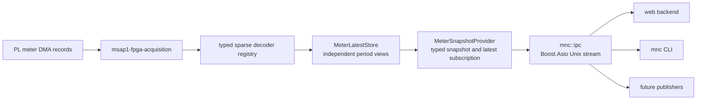
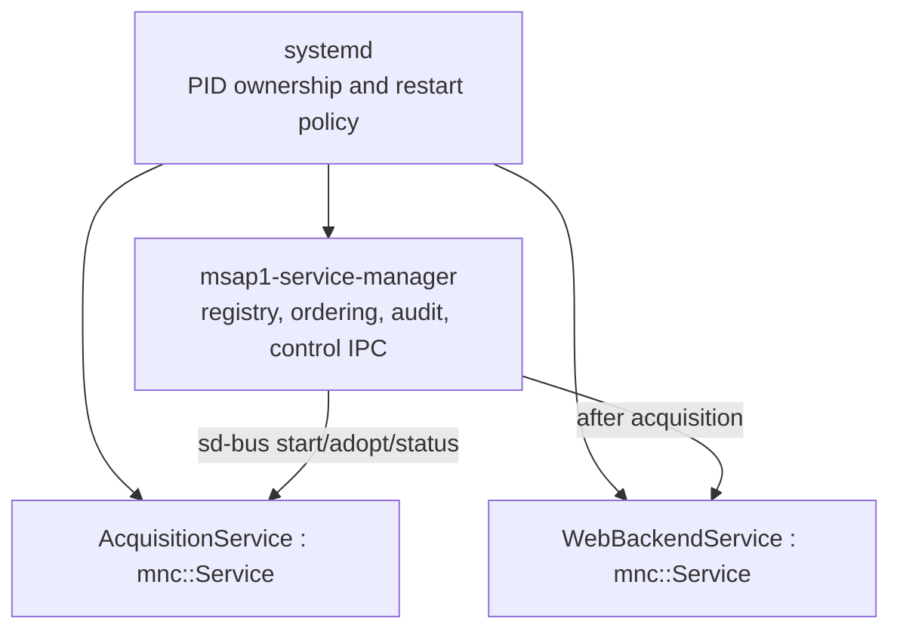
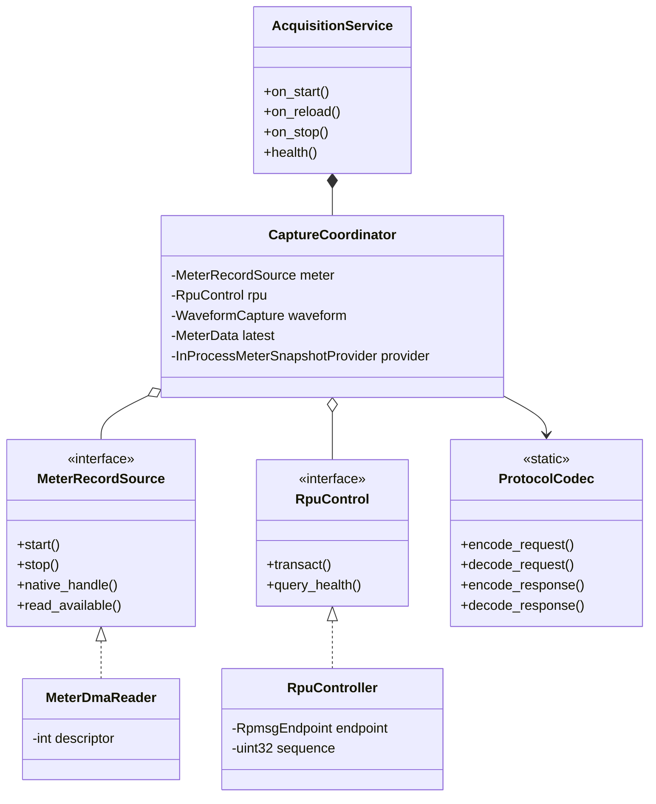
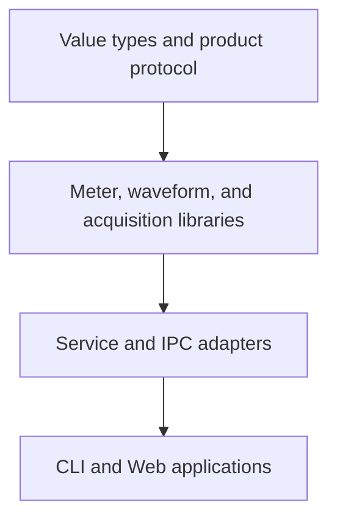

# IPC, meter data, and service architecture

## Latest-state data flow



The acquisition daemon validates and decodes each PL record, updates the
independent latest-period stores, and publishes a typed snapshot. This path is
deliberately a latest-value service: a slow subscriber may miss intermediate
updates and can never backpressure DMA acquisition. It makes no durability or
historian guarantee. The implemented `MeterRecordPublisher` and
`MeterStreamConsumer` path remains separate so database latency cannot affect
live metering; see the
[`MeterDataProvider` stream guide](../../common/mnc/MeterDataProvider/stream/README.md).

## Typed multi-period meter data

`MeterUpdate` is a sparse decoded PL update. A decoder declares its
measurement period and supplies only the value groups present in that record.
The BASIC-v4 decoders produce Basic fundamental updates — cycle-defined blocks
(10 cycles @ 50 Hz, 12 @ 60 Hz; see [TIMING_MODEL.md](TIMING_MODEL.md)), not
fixed 200 ms intervals — and v2 records additionally carry `BlockTiming`.
Future power, energy, demand, and power-quality formats register their own
decoders without changing the transport.

Canonical periods are `MeasurementPeriod::Basic`, `Cycles150_180`, `Min10`,
and `Hour2`. The Basic period has no fixed duration: each reading's actual
window is `sample_count / sample_rate` and travels in its `SampleWindow`.
Each `MeterLatestStore` slot is independent. For example, a new Basic
frequency never overwrites or supplies a missing aggregate frequency.

```cpp
const auto view = meter_data.latest(msap1::MeasurementPeriod::Basic);
if (view && view->values.fundamental.frequency.valid()) {
    const std::int64_t millihertz =
        view->values.fundamental.frequency.value;
}
```

Every reading carries its exact integer engineering unit, quality, source
sequence, measurement time, and PL calculation window. Unavailable and valid
zero are distinct states. The APU decodes and distributes measurements; it
does not calculate meter values.

Each latest-state subscription owns a small worker with a single pending
view. If its consumer is slow, a newer view replaces the unread one. This is
intentional for Web and telemetry publishing services: they cannot block
acquisition. Consumers that must observe every record use the
`MeterRecordPublisher -> DurableMeterSpool -> historian` pipeline rather than
this latest-state API.

## `mnc::ipc` transport

`mnc::ipc` is product-neutral. It uses
`boost::asio::local::stream_protocol`, so it explicitly frames the byte stream.
Every frame begins with this 24-byte little-endian envelope:

| Offset | Size | Field |
|---:|---:|---|
| 0 | 4 | `MNCI` magic |
| 4 | 2 | envelope version |
| 6 | 2 | request, response, event, or error kind |
| 8 | 4 | product-defined message type |
| 12 | 4 | payload size |
| 16 | 8 | correlation ID |

The transport always reads the complete header and then the declared payload.
It limits payload size, queued frames, and queued bytes; malformed, truncated,
oversized, or slow-client-overflow connections are closed. A connection has
one reader and one strand-serialized write queue. `RequestClient` matches
responses by correlation ID and dispatches server-pushed events. CLI commands
use `BlockingClient`, which runs the same coroutine transport behind a
synchronous facade.

MSAP1 message definitions remain in `msap1::acquisition::protocol`. Product
payloads use `ByteWriter`/`ByteReader` and explicit little-endian fields; do
not copy native structures, enum storage, padding, or floating-point layouts
onto the wire. Unix peer credentials are read with `SO_PEERCRED` for
authorization.

## Service lifecycle and manager



`mnc::Service::execute()` centralizes signal handling, readiness notification,
watchdog notification, reload dispatch, exception containment, and orderly
shutdown. Derived services implement only `on_start()`, `on_reload()`,
`on_stop()`, and `health()`.

`mnc::ServiceManager` does not replace systemd. It registers the product
services, starts them in dependency order, adopts already-running units after
its own restart, inspects restart counts through sd-bus, and exposes bounded
control through `/run/monutchee/service-manager.sock`. Read-only status is
available to diagnostics; mutating operations require root peer credentials.
Service-control protocol version 2 also reports each declared priority tier,
its expected nice value, the effective systemd value, and whether they match.

All services remain under `SCHED_OTHER`; the product does not use real-time
scheduling or unavailable target cgroup CPU/I/O weights:

| Tier | Nice | Services |
|---|---:|---|
| Critical | -10 | FPGA acquisition |
| High | -5 | Meter stream |
| Normal | 0 | Settings, service manager, web backend, Modbus, and time synchronization |
| Background | +5 | Historian, Data Sender, and MQTT |

The acquisition DMA/control loop inherits -10. Its IPC transport explicitly
runs at 0, while waveform archive discovery, materialization/compression, and
event-link delivery explicitly run at +5. This keeps filesystem, compression,
and historian delays away from the hardware-drain loop without granting a
real-time policy.

```sh
mnc service list
mnc service status fpga-acquisition
mnc service restart web-backend
mnc service reload fpga-acquisition
```

Future publishers should inherit `mnc::Service`, use a persistent
`mnc::ipc::RequestClient`, subscribe to the desired `MeterData` period, and
keep their protocol-specific serialization outside the reusable transport.

## Waveform archive and Web data flow

New captures use MNCWF v5. The DMA loop snapshots the bounded source frames
and queues one background job; decimation, 1 MiB frame-aligned Zstd level-1
chunks, CRCs, complete post-write validation, retention, and atomic rename all
run outside the acquisition loop. Existing MNCWF v1-v4 captures remain
readable and age out without recompression.

nginx remains the authenticated static-file transport. It uses `sendfile`,
normal byte ranges and `Content-Length`, and media type `application/x-mncwf`.
It never adds `Content-Encoding` or dynamically gzip-compresses a waveform.
The Web module worker validates MNCWF v1-v5, expands v5 chunks with a pinned
decompression-only WASM decoder, and builds min/max pyramids before
transferring typed arrays to React.

PQ-event catalogue summaries carry `waveform_capture_count` without requiring
the link list. A selected detail request expands links, displays 25 at a time,
and resolves at most 32 distinct UUIDs per acquisition IPC request. The
acquisition loop dispatches at most eight queued IPC frames per turn, and
capture UUID lookup is indexed. Completed event details and resolved or
expired captures are not polled again.

Post-capture format conversion is a process-local task owned by the persistent
Web backend; it is not another system service and never participates in DMA
draining or MNCWF materialization. `WaveformExportTaskManager` retains a
securely opened MNCWF v4/v5 descriptor and runs one bounded `std::jthread`.
Each accepted job has a stop source plus a promise/shared-future completion
signal; the worker performs the conversion while REST handlers submit, poll,
cancel, and read chunks through normal in-process calls. Generated CFF, legacy
CFG/DAT ZIP, and PQDIF artifacts are private `mnc-web` cache objects with a
30-minute TTL and are streamed through the authenticated backend rather than
an nginx filesystem alias. Tasks and artifacts are intentionally purged when
the Web backend restarts.

The Web application owns export jobs above individual pages. It persists only
owner-scoped job state in `sessionStorage`, resumes polling after navigation or
reload, automatically starts each completed same-origin download once, and
keeps an explicit download-again fallback. Task-manager initialization failure
removes only the converted capabilities; capture browsing and direct MNCWF
downloads remain available. The local CLI uses the same converter classes
directly and therefore needs no Web process or converter socket.

## Focused libraries and ownership

The CMake graph deliberately separates reusable infrastructure from MSAP1
product behavior:

```text
mnc::ipc                 framed Unix-stream transport only
mnc::logging             structured journal writer and reader
mnc::service             process lifecycle and systemd integration
mnc::waveform            product-neutral source/sink/converter contracts,
                         COMTRADE CFF/ZIP and PQDIF writers

msap1::meter             record values, decoders, latest store and provider
msap1::waveform          waveform DMA/session/file ownership
msap1::acquisition       product protocol, meter DMA and RPU adapters
msap1::system            temperature and image identity
msap1::service-protocol  service-manager product messages
```

The compatibility target `msap1::apu-core` remains an interface-only umbrella
for downstream code that has not yet selected a focused dependency. New code
must link the smallest target it needs. Configure-time checks reject direct
dependencies from meter/waveform value libraries to IPC, WebEngine, or CLI
presentation code.



`MeterDmaReader` and `RpuController` are RAII adapters. Their abstract source
and control contracts let host tests inject fakes without opening `/dev` or an
RPMsg endpoint. `CaptureCoordinator` owns ordering and policy; it does not own
transport details. `AcquisitionService` stays thin and delegates lifecycle to
the coordinator while `mnc::Service` handles signals, readiness, watchdogs,
and exception containment.

The Web backend follows the same boundary. `AcquisitionGateway` owns the
persistent `AcquisitionClient` and presents typed product operations to HTTP
handlers. A handler can ask for `information()`, `waveform_status()`, or
`set_adc_source()` but cannot construct an MNCI frame or manage correlation
IDs. Existing routes and JSON DTOs remain unchanged.

The CLI already uses a command registry plus polymorphic text/JSON result
generators. Command handlers share typed acquisition/service clients; output
selection does not repeat an operation or change its side effects.

## Dependency direction

Maintain this one-way dependency flow:



- `mnc::ipc` never interprets MSAP1 message types or meter payloads.
- `msap1::meter` never links WebEngine or CLI formatting.
- HTTP handlers never open DMA, RPMsg, SPI, or `/dev/mem` resources.
- CLI commands never access DMA or acquisition internals directly.
- Acquisition-owned adapters are the only owners of hardware descriptors.
- Lossy latest-state subscribers never block acquisition.
