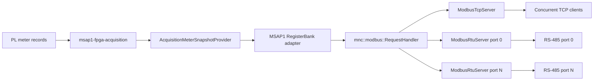

# MSAP1 Modbus Server Architecture

## Purpose

`msap1-modbus-server` is a protocol gateway for the latest PL-calculated meter
values. It supports concurrent Modbus TCP clients and multiple independent
Modbus RTU serial ports while sharing one product register map and one request
processor. The gateway is deliberately a lossy latest-state consumer: durable
historical delivery remains the responsibility of the meter stream and
historian services.

The implementation uses C++23, Boost.Asio coroutines, explicit dependency
injection, and Boost.CRC. It introduces no second measurement cache and never
opens DMA, RPMsg, SQLite, or waveform devices.



## Design patterns and boundaries

The design uses a small number of patterns where they clarify ownership:

- **Dependency injection:** `RequestHandler` depends on the abstract
  `RegisterBank`; `Msap1RegisterBank` depends on the existing abstract
  `MeterSnapshotProvider`. Unit tests inject in-memory fakes.
- **Adapter:** `Msap1RegisterBank` translates typed meter attributes and
  quality into the source-controlled external Modbus contract.
- **Strategy:** TCP and RTU are interchangeable `ModbusTransport`
  implementations around the same protocol engine.
- **Composite:** `ModbusServer` starts and stops any configured combination of
  transports as one lifecycle-owned subsystem.

`mnc::modbus` is product-neutral and knows neither MSAP1 fields nor product
settings. `msap1::modbus` owns the product register addresses. The executable
is the composition root that injects the concrete provider, map, handler, and
transports.

## Protocol processing

The shared request handler initially supports:

| Function | Name | Common engine | Initial MSAP1 map |
|---:|---|---|---|
| `0x03` | Read Holding Registers | Yes | Map metadata |
| `0x04` | Read Input Registers | Yes | Meter values and quality |
| `0x06` | Write Single Register | Yes | Rejected: read-only map |
| `0x10` | Write Multiple Registers | Yes | Rejected: read-only map |

Unsupported functions return Illegal Function. Invalid quantities, payloads,
or addresses return the corresponding Modbus exception. The common write
paths are retained so a future product can inject a writable `RegisterBank`
without duplicating framing or request logic.

The product-neutral exception model contains the complete standard Modbus
exception-code set. A `RegisterBank` returns the code that describes its
failure and the request handler preserves that code in the TCP or RTU
exception response:

| Code | Name | Intended use |
|---:|---|---|
| `0x01` | Illegal Function | Function is not implemented or permitted |
| `0x02` | Illegal Data Address | Register range is not mapped |
| `0x03` | Illegal Data Value | Quantity or request value is invalid |
| `0x04` | Server Device Failure | Unrecoverable internal processing failure |
| `0x05` | Acknowledge | Request was accepted but needs more time |
| `0x06` | Server Device Busy | A long-running operation prevents service |
| `0x08` | Memory Parity Error | Extended-memory consistency check failed |
| `0x0A` | Gateway Path Unavailable | Gateway cannot reach the target path |
| `0x0B` | Gateway Target Failed to Respond | Target device did not answer the gateway |

The initial read-only MSAP1 register bank normally emits `0x01` through
`0x04`. The remaining codes are available to future writable, asynchronous,
memory-backed, and gateway register-bank implementations without changing the
wire protocol. Codes `0x07` and `0x09` are reserved and intentionally absent.

### TCP

`ModbusTcpServer` uses `boost::asio::ip::tcp` and an awaitable session per
client. A session reads exactly the seven-byte MBAP header, validates protocol
ID and length, then reads exactly the PDU. It does not assume a kernel read is
a Modbus request. The reply preserves the transaction ID. Each client has an
independent coroutine, so a fragmented or slow connection cannot block other
clients. The configured client limit bounds resource use.

### RTU

`ModbusRtuServer` creates one asynchronous `boost::asio::serial_port` owner
per enabled device. Each port has independent receive assembly, CRC checking,
unit filtering, and error recovery. Configured ports are opened atomically:
failure to open any candidate port rejects that runtime configuration so the
service can restore its previous working transports.

After startup, a read/write failure closes only the affected RTU port and
cancels its pending timer and response queue; the remaining configured ports
continue serving requests. Response queues are bounded, so a stalled serial
peer cannot cause unbounded memory growth.

RTU CRC16 is calculated with `boost::crc_optimal` using the Modbus polynomial
and reflection rules. Supported requests are parsed by their function-specific
length. Unsupported functions remain buffered because their request length is
not generally knowable; the 3.5-character silent interval then finalizes the
whole request before CRC validation and the Illegal Function response. Above
19,200 baud the timer uses the Modbus fixed 1.75 ms interval. Known supported
requests retain immediate length-based dispatch for compatibility and latency.

## Coherent data access

For an input-register request, `Msap1RegisterBank` first identifies the one
measurement period and all attributes required by that range. It asks
`MeterSnapshotProvider` once, then projects every requested register from the
returned immutable snapshot. It never fetches one measurement per register.
Therefore a read spanning multiple values within Basic or 10-minute data
cannot mix acquisition sequences. A request spanning incompatible periods is
rejected with Illegal Data Address.

The cross-process `AcquisitionMeterSnapshotProvider` is a typed adapter over the
existing acquisition client. Modbus code does not construct IPC frames or
depend on acquisition command IDs.

The adapter is currently synchronous and the service intentionally owns one
Asio worker. A delayed acquisition reply can therefore pause all Modbus
transports temporarily. Invalid register ranges are prevalidated before this
IPC call. A future latest-snapshot subscription/cache should remove valid-read
round trips without weakening the one-coherent-snapshot rule; spawning a thread
per Modbus client is not the intended solution.

## MSAP1 register contract schema

The product ABI is defined by one human-maintained `constexpr` schema under
`common/msap1/modbus/register_map`. It has three deliberately small layers:

```text
explicit stable RegisterBlock bases
        + dense/indexed generators
                    ↓
          sorted constexpr map
                    ↓
       compile-time contract checks
                    ↓
        binary runtime address lookup
                    ↓
      runtime / tests / map exporter
```

Absolute addresses are assigned at stable group boundaries. Repeated values
inside a group advance automatically by their declared datatype width. This
avoids thousands of hand-written absolute entries without creating a global
auto-packer where inserting one value could renumber unrelated registers.

Measurement-backed definitions directly identify a `MeasurementPeriod` and
`MeterAttributeKey`, including an optional index for future harmonic families.
Only metadata and provenance fields use the small Modbus-specific
`SpecialRegister` enum. The complete flat map is validated at compile time for
block overlap, field overlap, datatype width, block escape, 16-bit address
overflow, sort order, and accidental duplicate logical sources.

Lookup uses binary search over the sorted generated map. Undefined addresses
inside reserved regions remain Illegal Data Address until a future contract
version actually maps them.

### Reserved address blocks

The existing version-1 addresses remain unchanged. Major future groups have
stable reserved regions so additions do not shift published fields:

| Function | Range | Purpose |
|---:|---:|---|
| FC03 | `0x0000–0x00FF` | Map metadata and future holding metadata |
| FC04 | `0x0000–0x001F` | Published Basic measurements and status |
| FC04 | `0x0020–0x00FF` | Reserved legacy Basic-period growth |
| FC04 | `0x0100–0x0FFF` | Basic extensions, including lifetime energy |
| FC04 | `0x1000–0x1FFF` | 150/180-cycle measurements |
| FC04 | `0x2000–0x2FFF` | Demand and 10-minute measurements |
| FC04 | `0x3000–0x3FFF` | 2-hour measurements |
| FC04 | `0x4000–0x4FFF` | Voltage harmonics |
| FC04 | `0x5000–0x5FFF` | Current harmonics |
| FC04 | `0x6000–0x6FFF` | Future power-quality measurements |

The current `Basic` period represents the grid-synchronized 10/12-cycle
product. Reserved regions are an ABI allocation policy, not an indication that
their future measurements are implemented today.

## MSAP1 register contract, version 2

All addresses below are zero-based protocol addresses. Some Modbus tools show
Input Register address 0 as `30001` and Holding Register address 0 as `40001`.
Always check the tool's addressing convention.

### Input registers (`0x04`)

| Address | Words | Type | Meaning | Unit |
|---:|---:|---|---|---|
| 0 | 2 | float32 | Frequency | Hz |
| 2 | 2 | float32 | Va line-to-neutral RMS | V |
| 4 | 2 | float32 | Vb line-to-neutral RMS | V |
| 6 | 2 | float32 | Vc line-to-neutral RMS | V |
| 8 | 2 | float32 | Ia RMS | A |
| 10 | 2 | float32 | Ib RMS | A |
| 12 | 2 | float32 | Ic RMS | A |
| 14 | 2 | float32 | Neutral current RMS | A |
| 16 | 1 | uint16 | Valid-quality mask, bits 0..7 in table order | bitmap |
| 17 | 1 | uint16 | Measurement-period identifier | enum |
| 18 | 2 | uint32 | Low 32 bits of source sequence | count |
| 20 | 2 | uint32 | Configuration generation | count |

M17 appends the following stable ranges. Every phase group is ordered A, B,
C, total. Each 64-bit value occupies four consecutive registers in high-word-
first order; the range endpoints below include all four values.

| Address range | Type | Meaning | Unit |
|---:|---|---|---|
| `0x0100–0x010F` | uint64 | Active import energy A/B/C/total | uWh |
| `0x0110–0x011F` | uint64 | Active export energy A/B/C/total | uWh |
| `0x0120–0x012F` | uint64 | Apparent energy A/B/C/total | uVAh |
| `0x0130–0x013F` | uint64 | Reactive quadrant I A/B/C/total | uvarh |
| `0x0140–0x014F` | uint64 | Reactive quadrant II A/B/C/total | uvarh |
| `0x0150–0x015F` | uint64 | Reactive quadrant III A/B/C/total | uvarh |
| `0x0160–0x016F` | uint64 | Reactive quadrant IV A/B/C/total | uvarh |
| `0x0170–0x018D` | mixed | Energy session, epoch, provenance, flags, and quality mask | metadata |
| `0x2000–0x200F` | int64 | Signed current active demand A/B/C/total | uW |
| `0x2010–0x201F` | uint64 | Active import peaks A/B/C/total | uW |
| `0x2020–0x202F` | uint64 | Active export peaks A/B/C/total | uW |
| `0x2030–0x206F` | mixed | Demand session, epoch, profile, quality, flags, and peak anchors | metadata |

Energy metadata starts at `0x0170`: session ID, reset epoch, last sample,
accepted/skipped samples and blocks, flags, then the 64-bit quality mask.
Energy flag bits 0--2 are saturation, incomplete input, and discontinuity.
Demand metadata starts at `0x2030`: session ID, peak reset epoch, last sample,
window anchor, interval count/status, method, window seconds, update seconds,
profile generation, flags, quality mask, and import/export peak sample anchors.
Demand flag bits 0--4 are time aligned, contaminated, boundary valid,
saturated, and incomplete input. Use the generated map export for every exact
field address rather than copying this range summary into client code.

Unavailable or invalid electrical values are encoded as IEEE-754 quiet NaN.
The corresponding quality bit is clear. A valid zero is encoded as `0.0` and
has its quality bit set, preserving the product-wide distinction between zero
and unavailable.

### Holding registers (`0x03`)

| Address | Words | Type | Meaning | Value |
|---:|---:|---|---|---:|
| 0 | 1 | uint16 | Register-map version | 2 |
| 1 | 1 | uint16 | Word-order marker | `0x1234` |
| 2 | 1 | uint16 | Published measurement-attribute count | 48 |

The table above is produced from the compiled schema; runtime JSON/YAML and
per-register `std::function` objects are intentionally not used.

### Register map export

The development utility consumes the exact definitions used by the server:

```sh
modbus-map-dump --format text
modbus-map-dump --format csv
modbus-map-dump --format markdown
modbus-map-dump --format json
```

Markdown output also includes every reserved block. Customer documentation can
therefore be generated from the same source used by runtime and tests instead
of maintaining a parallel address table.

JSON output uses the versioned schema `mnc.modbus-register-map.v1`. It contains
both mapped logical registers and reserved address blocks. Addresses are
zero-based Modbus protocol addresses; numeric values are accompanied by hex
display strings. Function codes, source kinds, measurement attributes, indexed
attributes, measurement periods, data types, word counts, aliases, and the
high-word-first convention are represented as separate fields so documentation
generators do not need to parse human-readable labels.

For example, a Python documentation generator can load the map directly:

```python
import json
import subprocess

document = json.loads(subprocess.check_output(
    ["modbus-map-dump", "--format", "json"], text=True))

for register in document["registers"]:
    print(register["function_code"], register["address"], register["source"])
```

## Encoding

Modbus bytes are network/big-endian. Multiword 32-bit and 64-bit integers and
IEEE-754 float32 values use **high word first**. Signed integers use their
two's-complement bit pattern. For example:

```text
uint32 0x12345678 -> register 0 = 0x1234, register 1 = 0x5678
float32 1.0       -> register 0 = 0x3f80, register 1 = 0x0000
uint64 0x0123456789abcdef
                  -> registers = 0x0123, 0x4567, 0x89ab, 0xcdef
int64 -2          -> registers = 0xffff, 0xffff, 0xffff, 0xfffe
```

Encoding helpers use shifts and `std::bit_cast`; they do not depend on CPU
endianness or object aliasing.

## Settings and hot reload

Modbus settings are part of the central product settings document:

```json
"modbus": {
  "enabled": true,
  "tcp": {
    "enabled": true,
    "listen_address": "0.0.0.0",
    "port": 502,
    "maximum_clients": 16,
    "unit_id": 1
  },
  "rtu": []
}
```

Each RTU entry contains `enabled`, `device`, `baud_rate`, `parity`,
`data_bits`, `stop_bits`, and `unit_id`. The settings validator rejects invalid
unit IDs, ports, serial shapes, or duplicate enabled device paths.

The service observes the settings authority and requests an `mnc::Service`
reload when the Modbus section changes. It stops only its transports, applies
the candidate, and restores the last working runtime configuration if a TCP
bind or serial open fails. Acquisition continues throughout this operation.

## Runtime security and ownership

The Yocto unit runs as the unprivileged `mnc-modbus` account. It receives only
the settings/data socket group access needed for typed snapshots, `dialout`
for configured serial ports, and `CAP_NET_BIND_SERVICE` for TCP port 502.
Systemd remains the process supervisor. The service is registered with
`msap1-service-manager` for dependency visibility and bounded control.

Modbus itself provides no confidentiality or authentication. Deployments must
place TCP behind the product network policy, and should not expose port 502 to
untrusted networks.

## Extending the implementation

To add a new published measurement:

1. Add or reuse a typed meter attribute in the meter catalog.
2. Select or reserve a stable `RegisterBlock` in
   `msap1_register_schema.hpp`; never shift an existing block.
3. Add the attribute to a dense group or indexed-family generator inside that
   block, then include the group in the flattened map.
4. Define its scalar encoding and quality behavior if the existing datatype
   handling is insufficient.
5. Increment the register-map version if the external contract changes.
6. Extend generator, boundary, word-order, quality, export, and
   snapshot-coherence tests.

To add a function code, extend the common `FunctionCode` and
`RequestHandler`; keep TCP/RTU limited to framing. If a function has a new RTU
request length, teach only `RtuFrameAssembler` that length. Product side
effects belong behind a product `RegisterBank` or another narrow injected
interface, never in the transport.

## Verification

Host tests cover FC03/04/06/10, exceptions, register boundaries, scalar
encodings, known CRC vectors, RTU fragmentation/coalescing and independent
assemblers, fragmented TCP frames, persistent requests, concurrent clients,
transaction IDs, coherent snapshot acquisition, unavailable-as-NaN, and the
quality bitmap. Schema fixtures additionally prove that invalid overlapping
blocks/fields, block escape, incorrect width, address overflow, and duplicate
logical sources are rejected at compile time. Runtime tests exercise generated
dense/indexed addressing, binary lookup, partial reads, projected snapshot
requests, and exact exporter coverage.

Target validation should additionally use an independent client such as
`pymodbus`, `modpoll`, or QModMaster. Verify both zero-based and displayed
30001/40001 address conventions, high-word-first float decoding, multiple TCP
clients, and each installed RS-485 port independently.
