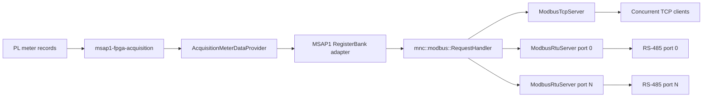

# MSAP1 Modbus Server Architecture

## Purpose

`msap1-modbus-server` is a protocol gateway for the latest PL-calculated meter
values. It supports concurrent Modbus TCP clients and multiple independent
Modbus RTU serial ports while sharing one product register map and one request
processor. The gateway is deliberately a lossy latest-state consumer: durable
historical delivery remains the responsibility of the meter stream and
historian services.

The implementation uses C++23, Boost.Asio coroutines, explicit dependency
injection, and Boost.CRC. It introduces no second measurement cache and never
opens DMA, RPMsg, SQLite, or waveform devices.



## Design patterns and boundaries

The design uses a small number of patterns where they clarify ownership:

- **Dependency injection:** `RequestHandler` depends on the abstract
  `RegisterBank`; `Msap1RegisterBank` depends on the existing abstract
  `MeterSnapshotProvider`. Unit tests inject in-memory fakes.
- **Adapter:** `Msap1RegisterBank` translates typed meter attributes and
  quality into the source-controlled external Modbus contract.
- **Strategy:** TCP and RTU are interchangeable `ModbusTransport`
  implementations around the same protocol engine.
- **Composite:** `ModbusServer` starts and stops any configured combination of
  transports as one lifecycle-owned subsystem.

`mnc::modbus` is product-neutral and knows neither MSAP1 fields nor product
settings. `msap1::modbus` owns the product register addresses. The executable
is the composition root that injects the concrete provider, map, handler, and
transports.

## Protocol processing

The shared request handler initially supports:

| Function | Name | Common engine | Initial MSAP1 map |
|---:|---|---|---|
| `0x03` | Read Holding Registers | Yes | Map metadata |
| `0x04` | Read Input Registers | Yes | Meter values and quality |
| `0x06` | Write Single Register | Yes | Rejected: read-only map |
| `0x10` | Write Multiple Registers | Yes | Rejected: read-only map |

Unsupported functions return Illegal Function. Invalid quantities, payloads,
or addresses return the corresponding Modbus exception. The common write
paths are retained so a future product can inject a writable `RegisterBank`
without duplicating framing or request logic.

The product-neutral exception model contains the complete standard Modbus
exception-code set. A `RegisterBank` returns the code that describes its
failure and the request handler preserves that code in the TCP or RTU
exception response:

| Code | Name | Intended use |
|---:|---|---|
| `0x01` | Illegal Function | Function is not implemented or permitted |
| `0x02` | Illegal Data Address | Register range is not mapped |
| `0x03` | Illegal Data Value | Quantity or request value is invalid |
| `0x04` | Server Device Failure | Unrecoverable internal processing failure |
| `0x05` | Acknowledge | Request was accepted but needs more time |
| `0x06` | Server Device Busy | A long-running operation prevents service |
| `0x08` | Memory Parity Error | Extended-memory consistency check failed |
| `0x0A` | Gateway Path Unavailable | Gateway cannot reach the target path |
| `0x0B` | Gateway Target Failed to Respond | Target device did not answer the gateway |

The initial read-only MSAP1 register bank normally emits `0x01` through
`0x04`. The remaining codes are available to future writable, asynchronous,
memory-backed, and gateway register-bank implementations without changing the
wire protocol. Codes `0x07` and `0x09` are reserved and intentionally absent.

### TCP

`ModbusTcpServer` uses `boost::asio::ip::tcp` and an awaitable session per
client. A session reads exactly the seven-byte MBAP header, validates protocol
ID and length, then reads exactly the PDU. It does not assume a kernel read is
a Modbus request. The reply preserves the transaction ID. Each client has an
independent coroutine, so a fragmented or slow connection cannot block other
clients. The configured client limit bounds resource use.

### RTU

`ModbusRtuServer` creates one asynchronous `boost::asio::serial_port` owner
per enabled device. Each port has independent receive assembly, CRC checking,
unit filtering, and error recovery. One serial-device failure is reported but
does not stop other ports or TCP.

RTU CRC16 is calculated with `boost::crc_optimal` using the Modbus polynomial
and reflection rules. Supported requests are parsed by their function-specific
length. A 3.5-character silence timer discards incomplete data before the next
frame; above 19,200 baud it uses the Modbus fixed 1.75 ms interval.

## Coherent data access

For an input-register request, `Msap1RegisterBank` first asks
`MeterSnapshotProvider` for all required Basic-period attributes. It performs
that request once, then projects every requested register from the returned
immutable snapshot. It never fetches one measurement per register. Therefore
a read spanning frequency, voltage, and current cannot mix acquisition
sequences.

The cross-process `AcquisitionMeterDataProvider` is a typed adapter over the
existing acquisition client. Modbus code does not construct IPC frames or
depend on acquisition command IDs.

## MSAP1 register contract, version 1

All addresses below are zero-based protocol addresses. Some Modbus tools show
Input Register address 0 as `30001` and Holding Register address 0 as `40001`.
Always check the tool's addressing convention.

### Input registers (`0x04`)

| Address | Words | Type | Meaning | Unit |
|---:|---:|---|---|---|
| 0 | 2 | float32 | Frequency | Hz |
| 2 | 2 | float32 | Va line-to-neutral RMS | V |
| 4 | 2 | float32 | Vb line-to-neutral RMS | V |
| 6 | 2 | float32 | Vc line-to-neutral RMS | V |
| 8 | 2 | float32 | Ia RMS | A |
| 10 | 2 | float32 | Ib RMS | A |
| 12 | 2 | float32 | Ic RMS | A |
| 14 | 2 | float32 | Neutral current RMS | A |
| 16 | 1 | uint16 | Valid-quality mask, bits 0..7 in table order | bitmap |
| 17 | 1 | uint16 | Measurement-period identifier | enum |
| 18 | 2 | uint32 | Low 32 bits of source sequence | count |
| 20 | 2 | uint32 | Configuration generation | count |

Unavailable or invalid electrical values are encoded as IEEE-754 quiet NaN.
The corresponding quality bit is clear. A valid zero is encoded as `0.0` and
has its quality bit set, preserving the product-wide distinction between zero
and unavailable.

### Holding registers (`0x03`)

| Address | Words | Type | Meaning | Value |
|---:|---:|---|---|---:|
| 0 | 1 | uint16 | Register-map version | 1 |
| 1 | 1 | uint16 | Word-order marker | `0x1234` |
| 2 | 1 | uint16 | Published measurement-attribute count | 8 |

The descriptor table is a small `constexpr` array. A compile-time check
rejects overlapping addresses and widths inconsistent with their data type.
This keeps the external contract reviewable and allocation-free without a
runtime JSON/YAML map or per-register `std::function` objects.

## Encoding

Modbus bytes are network/big-endian. Multiword 32-bit integers and IEEE-754
float32 values use **high word first**. For example:

```text
uint32 0x12345678 -> register 0 = 0x1234, register 1 = 0x5678
float32 1.0       -> register 0 = 0x3f80, register 1 = 0x0000
```

Encoding helpers use shifts and `std::bit_cast`; they do not depend on CPU
endianness or object aliasing.

## Settings and hot reload

Modbus settings are part of the central product settings document:

```json
"modbus": {
  "enabled": true,
  "tcp": {
    "enabled": true,
    "listen_address": "0.0.0.0",
    "port": 502,
    "maximum_clients": 16,
    "unit_id": 1
  },
  "rtu": []
}
```

Each RTU entry contains `enabled`, `device`, `baud_rate`, `parity`,
`data_bits`, `stop_bits`, and `unit_id`. The settings validator rejects invalid
unit IDs, ports, serial shapes, or duplicate enabled device paths.

The service observes the settings authority and requests an `mnc::Service`
reload when the Modbus section changes. It stops only its transports, applies
the candidate, and restores the last working runtime configuration if a TCP
bind or serial open fails. Acquisition continues throughout this operation.

## Runtime security and ownership

The Yocto unit runs as the unprivileged `mnc-modbus` account. It receives only
the settings/data socket group access needed for typed snapshots, `dialout`
for configured serial ports, and `CAP_NET_BIND_SERVICE` for TCP port 502.
Systemd remains the process supervisor. The service is registered with
`msap1-service-manager` for dependency visibility and bounded control.

Modbus itself provides no confidentiality or authentication. Deployments must
place TCP behind the product network policy, and should not expose port 502 to
untrusted networks.

## Extending the implementation

To add a new published measurement:

1. Add or reuse a typed meter attribute in the meter catalog.
2. Add a `MeterField` and static register descriptor without overlapping the
   existing map.
3. Request the attribute in the one coherent snapshot.
4. Encode it with the explicit helper and define its quality behavior.
5. Increment the register-map version if the external contract changes.
6. Extend map-boundary, word-order, quality, and snapshot-coherence tests.

To add a function code, extend the common `FunctionCode` and
`RequestHandler`; keep TCP/RTU limited to framing. If a function has a new RTU
request length, teach only `RtuFrameAssembler` that length. Product side
effects belong behind a product `RegisterBank` or another narrow injected
interface, never in the transport.

## Verification

Host tests cover FC03/04/06/10, exceptions, register boundaries, scalar
encodings, known CRC vectors, RTU fragmentation/coalescing and independent
assemblers, fragmented TCP frames, persistent requests, concurrent clients,
transaction IDs, coherent snapshot acquisition, unavailable-as-NaN, and the
quality bitmap.

Target validation should additionally use an independent client such as
`pymodbus`, `modpoll`, or QModMaster. Verify both zero-based and displayed
30001/40001 address conventions, high-word-first float decoding, multiple TCP
clients, and each installed RS-485 port independently.
